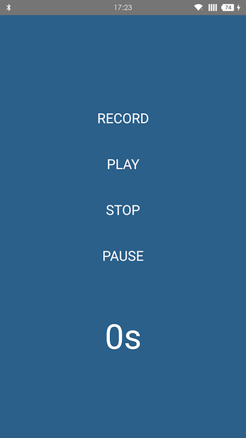

Audio Example
------------------

Migration from [AudioExample](https://github.com/jsierles/react-native-audio/tree/master/AudioExample)

@2018/05/09


### Installation

clone this project, cd the AudioExample then:

```
$ npm i
$ react-native link
```

add permission config like the doc said:

```
<uses-permission android:name="android.permission.RECORD_AUDIO" />
```

put the permission in android config file: 

> AudioExample/android/app/src/main/AndroidManifest.xml


### Run

```
$ react-native run-android
```


